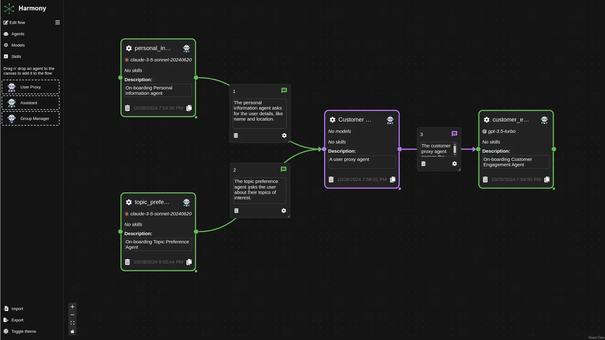

# Harmony

[](https://x.com/harmonicsystems)

## Make AI Agents Collaborate: Drag, Drop, and Orchestrate with Harmony




## Installation

On PyPI:

```bash
python -m pip install harmony
```

## Usage

### Using docker/podman


```shell
CONTAINER_COMMAND=docker # or podman
# pull the image
$CONTAINER_COMMAND pull harmony/harmony
# Convert a Harmony flow to a python script or a jupyter notebook
$CONTAINER_COMMAND run \
  --rm \
  -v /path/to/a/flow.harmony:/flow.harmony \
  -v /path/to/an/output:/output \
  harmony/harmony convert --file /flow.harmony --output /output/flow[.py|.ipynb] [--force]

# with selinux and/or podman, you might get permission (or file not found) errors, so you can try:
$CONTAINER_COMMAND run \
  --rm \
  -v /path/to/a/flow.harmony:/flow.harmony \
  -v /path/to/an/output:/output \
  --userns=keep-id \
  --security-opt label=disable \
  harmony/harmony convert --file /flow.harmony --output /output/flow[.py|.ipynb] [--force]
```

```shell
# Convert and run the script
$CONTAINER_COMMAND run \
  --rm \
  -v /path/to/a/flow.harmony:/flow.harmony \
  -v /path/to/an/output:/output \
  harmony/harmony run --file /flow.harmony --output /output/output[.py]
```

## License

This project is licensed under the [Apache License, Version 2.0 (Apache-2.0)](https://github.com/harmonic-systems/harmony/blob/main/LICENSE).
