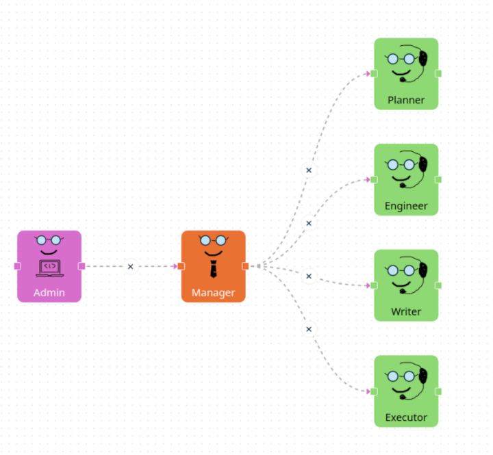

# Harmony

[](./flow.png)

To a python script or a jupyter notebook with the corresponding [pyautogen](https://github.com/microsoft/autogen/) agents and chats.

## Features

- Export .harmony flows to .py or .ipynb
- Run a .harmony flow
- Include a `logs` folder with the logs of the flow in csv format
- Provide a custom [IOSStream](https://autogen-ai.github.io/autogen/docs/reference/io/base#iostream) to handle input and output.

## Installation

From this repository:

```bash
python -m pip install git+https://github.com/harmony/py.git
```

## Usage

```bash
# Export a Harmony flow to a python script or a jupyter notebook
harmony --export /path/to/a/flow.harmony --output /path/to/an/output[.py|.ipynb]
# Export and run the script, optionally force generation if the output file already exists
harmony /path/to/a/flow.harmony --output /path/to/an/output[.py] [--force]
```

### Tools

- [pyautogen](https://github.com/microsoft/autogen/)
- [juptytext](https://github.com/mwouts/jupytext)
- [twisted](https://github.com/twisted/twisted)
- [pydantic](https://github.com/pydantic/pydantic)
